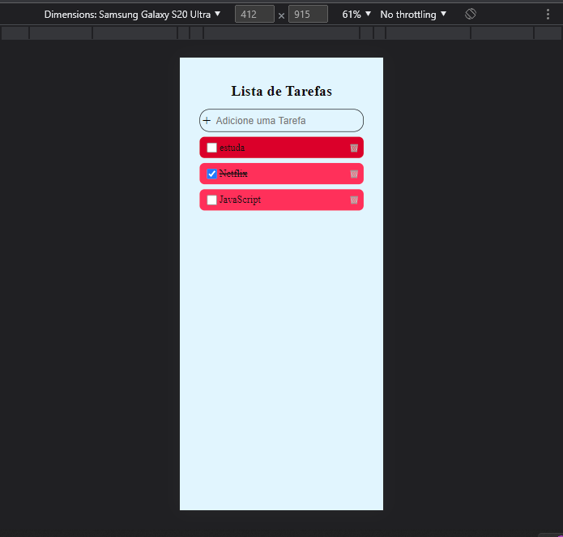

# lista de tarefas

### Criando uma lista de tarefa usando locastorage 

   todo list 100% responsivo todas as tarefas são armazenadas no localStorage, feito uma função para deleta e adicionar as tarefa da lista, e outra função para gera uma cor aleatoria na tarefa
    
    
    Com esse projeto de todo list eu quis desafia minhas habilidade atualmente fazendo mais que um todo list genérico usando localstorage e uma function para gera novas cores quando adicionado uma nova tarefa, confesso que foi muito gratificante ser desafia a  resolver bug e pensa em outra possibilidade que possa gera algum erro no projeto sempre com um usuário do sistema para entrega a melhor experiencia

    
    

## Tecnologia utilizada

- React
- TypeScript
- Styled-components
- uuidv4
